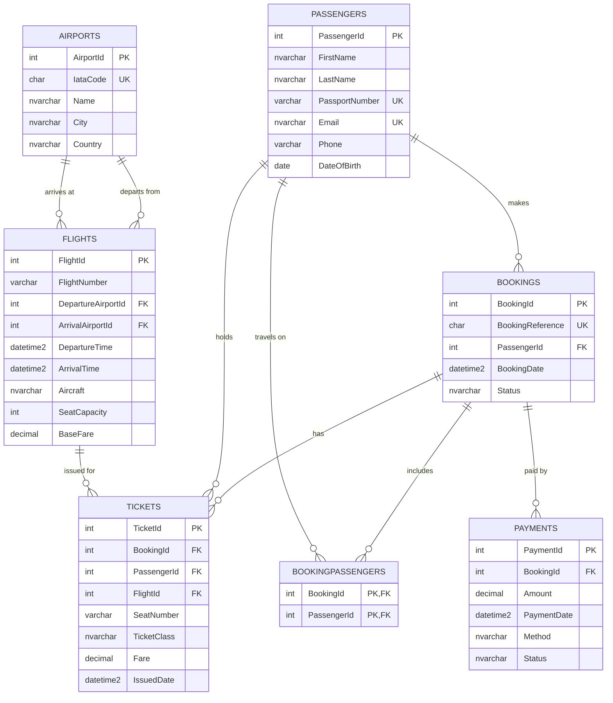

# ERD - SAA Flight Booking

Entity Relationship Diagram source for the SAA Flight Booking database.
Render this with any Mermaid-capable tool (for example the Mermaid Live Editor
at https://mermaid.live) and export the image for the assessment document.

## Relationships

- Airports 1 to many Flights (departure and arrival).
- Passengers 1 to many Bookings (the passenger who books).
- Bookings many to many Passengers, resolved by BookingPassengers.
- Bookings 1 to many Tickets; Passengers 1 to many Tickets; Flights 1 to many Tickets.
- Tickets carry a composite foreign key (BookingId, PassengerId) to BookingPassengers,
  so a ticket can only be issued for a passenger who is on the booking.
- Bookings 1 to many Payments.
